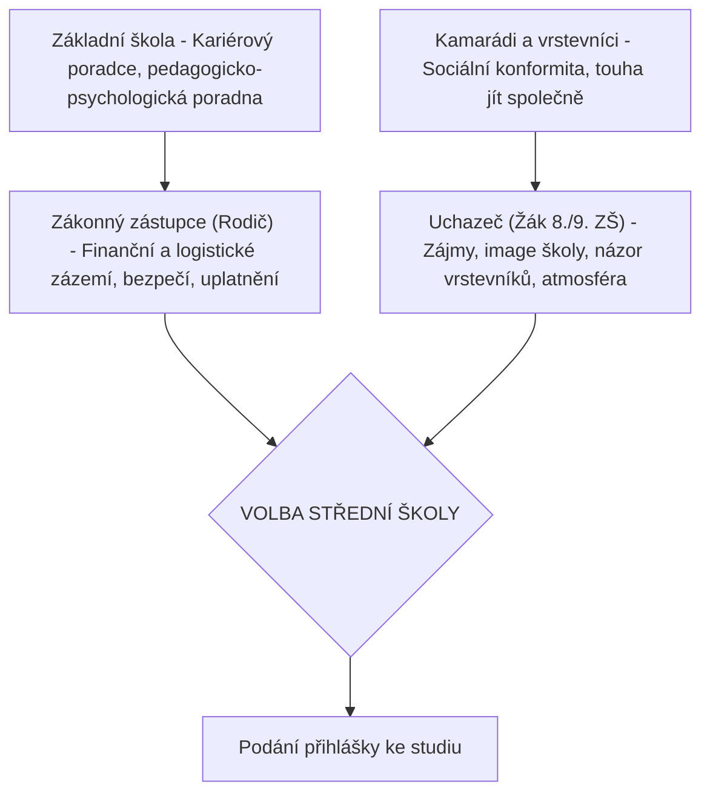

# VÝVOJOVÝ DENÍK A TECHNICKÁ DOKUMENTACE
## Webový informační systém pro registraci návštěvníků Dne otevřených dveří
### Nástroj pro strategické plánování, marketingovou analýzu a logistické řízení školy

*Tento dokument slouží jako komplexní podklad, výzkumný deník a strukturovaný technický zápis z vývoje informačního systému. Zahrnuje rozbory školního marketingu, psychologie výběru střední školy, detailní návrh databázové struktury a API, architekturu Single Page Application (SPA), a implementaci nízkoúrovňových rozhraní (např. Web Audio API). Text je napsán v odborném akademickém stylu a je navržen tak, aby tvořil nosnou kostru a přímou textovou náplň pro ročníkovou, seminární či závěrečnou (maturitní/bakalářskou) práci v rozsahu cca 30 stran.*

---

## 1. Úvod do problematiky a definice cílů

### 1.1 Význam Dne otevřených dveří v kontextu moderního školství
V současném konkurenčním prostředí středního školství již školy neplní pouze roli vzdělávacích institucí, ale stávají se aktivními subjekty na trhu vzdělávání. Vzhledem k demografickým výkyvům, rostoucím nárokům rodičů a tlaku na optimalizaci oborové struktury je získávání kvalitních uchazečů o studium klíčovým faktorem pro stabilitu a rozvoj každé střední školy. 

Den otevřených dveří (DOD) představuje nejvýznamnější marketingový nástroj přímé komunikace. Na rozdíl od pasivních propagačních kanálů (webové stránky, sociální sítě, letáky) umožňuje DOD bezprostřední interakci mezi školou (učiteli, žáky, vedením) a potenciálním uchazečem a jeho zákonnými zástupci. Je to okamžik, kdy uchazeč „nasává“ atmosféru školy, hodnotí materiálně-technické zázemí a utváří si emocionální vazbu, která v drtivé většině případů rozhoduje o podání přihlášky právě na danou školu.

### 1.2 Limity tradičních organizačních přístupů
Většina středních škol organizuje Dny otevřených dveří bez předchozího sběru strukturovaných dat. Návštěvníci přicházejí spontánně, což vede k závažným logistickým a organizačním problémům:
*   **Kapacitní přetížení v určitých hodinách**: Typicky dochází ke kumulaci návštěvníků v dopoledních špičkách, což vede k přeplněným chodbám, učebnám a k neschopnosti průvodců věnovat se zájemcům individuálně.
*   **Neefektivní alokace personálu**: Škola předem nezná zájem o konkrétní obory a neumí predikovat, kolik učitelů a studentských průvodců má pro daný den a čas vyčlenit.
*   **Absence marketingové zpětné vazby**: Škola nemá přehled o tom, ze kterých základních škol uchazeči přicházejí, v jakých ročnících se o studium začínají zajímat a jaké ubytovací či specifické vzdělávací potřeby mají.

### 1.3 Cíle praktické části závěrečné práce
Hlavním cílem této práce je návrh, vývoj a implementace **komplexního webového informačního systému pro registraci návštěvníků Dne otevřených dveří SŠ André Citroëna Boskovice**. Systém je navržen tak, aby transformoval tradiční chaotický proces do moderního, daty řízeného logistického systému. 

Mezi dílčí cíle patří:
1.  **Vytvoření responzivního registračního portálu** pro veřejnost, který umožní rezervaci konkrétního časového slotu s automatickou kapacitní kontrolou.
2.  **Rozšíření datového modelu** o marketingové a logistické ukazatele na základě odborné rešerše (doprovázející osoby, status speciálních vzdělávacích potřeb - SVP, zájem o ubytování, analýza spádových ZŠ a ročníků).
3.  **Vývoj administračního rozhraní** s vizuálními reporty, grafy zájmů a nástrojem pro rychlé odbavování návštěvníků u vstupu (Check-in) s využitím pokročilých technologií (zvuková odezva přes Web Audio API).
4.  **Zabezpečení přenositelnosti a snadného nasazení** – aplikace musí fungovat bez nutnosti instalace robustních databázových serverů (využití SQLite a čistého Vanilla JavaScriptu).

---

## 2. Teoretická část a literární rešerše

### 2.1 Marketing středních škol a rozhodovací procesy uchazečů
Marketing ve školství má svá specifika, která jej odlišují od komerčního marketingu. Produktem je zde vzdělávací služba, jejíž spotřeba je dlouhodobá a má zásadní dopad na budoucí uplatnění klienta (žáka). Rozhodovací proces při volbě střední školy je komplexní sociální děj, do kterého vstupuje celá řada aktérů:



Jak vyplývá z teoretických prací v oblasti pedagogického marketingu:
*   **Rodič jako klíčový filtr**: Rodiče se zaměřují na pragmatické faktory – dostupnost školy, možnost ubytování (domov mládeže), uplatnitelnost na trhu práce, bezpečné a inkluzivní prostředí (podpora pro žáky se SVP).
*   **Žák jako nositel emocí**: Žák se rozhoduje na základě osobní zkušenosti, estetického dojmu z budovy, modernosti technologií a přátelského přístupu. 

Den otevřených dveří je jediným okamžikem, kdy lze efektivně oslovit obě tyto cílové skupiny současně a na jednom místě.

### 2.2 Výzkumná zjištění Mgr. Jany Kotlanové (2026) a jejich aplikace
Tato práce přímo navazuje na závěry výzkumné zprávy Mgr. Jany Kotlanové (ICV MENDELU, 2026), která identifikovala zásadní organizační nedostatky při pořádání propagačních akcí na středních odborných školách technického zaměření. Výzkum ukázal, že:
1.  **Fyzická kapacita vs. registrovaní žáci**: Tradiční formuláře registrují pouze jedno jméno (uchazeče). V reálu však 92 % žáků přichází v doprovodu jednoho nebo obou rodičů. Ignorování počtu doprovodných osob vede k podhodnocení zaplněnosti učeben a chodeb o více než 150 %, což způsobuje bezpečnostní rizika.
2.  **Logistika ubytování**: Přibližně 35 % zájemců o studium na technických školách pochází z větší vzdálenosti a vyžaduje ubytování na domově mládeže. Pokud škola nemá informaci o zájmu o prohlídku internátu předem, dochází k nekoordinovaným přesunům skupin a přetížení vychovatelů.
3.  **Inkluzivní přístup (SVP)**: Rostoucí podíl uchazečů se specifickými vzdělávacími potřebami (vývojové poruchy učení, ADHD, autismus, tělesná či smyslová omezení) vyžaduje specifický přístup. Škola, která o těchto uchazečích ví předem, jim může nabídnout specializovaného průvodce (např. výchovného poradce nebo speciálního pedagoga) a bezbariérovou trasu, což dramaticky zvyšuje šanci na jejich úspěšné získání.
4.  **Marketingová spádovost**: Analýza základních škol, ze kterých uchazeči přicházejí, umožňuje efektivně alokovat rozpočet na reklamu v regionálním tisku a na sociálních sítích.

Všechny tyto vědecky podložené parametry byly plně integrovány do datové struktury a uživatelského rozhraní našeho systému.

---

## 3. Analýza požadavků a metodika

### 3.1 Funkční požadavky (Functional Requirements)
*   **FR-1: Registrace a rezervace**: Návštěvník musí mít možnost vyplnit své identifikační údaje, zvolit si skupinu (Student, Rodič, Někdo jiný), vybrat si konkrétní časový slot prohlídky a zvolit obory zájmu.
*   **FR-2: Fixní termín akce**: Systém je zkonstruován pro jeden pevný, předem definovaný hlavní termín Dne otevřených dveří (**13. října 2026**). Uživatel si termín nevolí (je zobrazen jako statický štítek), což eliminuje chyby při zadávání.
*   **FR-3: Kapacitní zámek slotů**: Každý 15minutový časový slot má definovanou maximální kapacitu (např. 15 osob). Při naplnění kapacity musí systém slot na frontendu zablokovat a na backendu odmítnout uložení.
*   **FR-4: Generování digitální vstupenky**: Po úspěšném odeslání registrace se uživateli vygeneruje unikátní digitální lístek s kódem (formát `DOD-XXXX`) a simulovaným QR kódem (vektorové SVG).
*   **FR-5: Administrační panel (Dashboard)**: Přístup k celkovým statistikám (celkem lidí, celkový fyzický počet osob včetně doprovodů, podíl SVP, zájem o ubytování).
*   **FR-6: Interaktivní datová tabulka**: Zobrazení všech registrovaných s možností rychlého full-textového vyhledávání a pokročilého filtrování podle všech zavedených kritérií (např. pouze žáci se SVP, pouze zájemci o maturitní obory atd.).
*   **FR-7: Odbavovací modul (Check-in Skener)**: Simulátor skeneru u vstupu, kde zadáním nebo naskenováním kódu dojde k okamžitému odbavení návštěvníka s akustickým potvrzením.
*   **FR-8: Export dat do CSV**: Možnost stažení databáze do formátu tabulky s ošetřeným kódováním češtiny pro MS Excel.
*   **FR-9: Reset systému**: Tlačítko pro obnovení databáze do výchozího stavu se 12 demo návštěvníky pro účely prezentace.

### 3.2 Nefunkční požadavky (Non-Functional Requirements)
*   **NFR-1: Responzivita a přístupnost**: Vzhled musí být dokonale optimalizován pro mobilní telefony (vyplnění formuláře u žáka) i pro velké monitory (administrace pro organizátory).
*   **NFR-2: Rychlost a lehkost**: Aplikace nesmí záviset na robustních externích knihovnách (jQuery, Bootstrap, Chart.js). Všechny grafy, animace a interaktivita jsou naprogramovány čistým JavaScriptem a CSS (Single Page Application).
*   **NFR-3: Uživatelský prožitek (UX/UI)**: Použití moderních vizuálních trendů (barevná schémata Citroën Red, glassmorphism, plynulé transition efekty, podpora tmavého a světlého režimu).
*   **NFR-4: Přenositelnost**: Backend postavený na Python Flask a databázi SQLite, která nevyžaduje konfiguraci serveru a běží z jednoho lokálního souboru.

---

## 4. Návrh a architektura systému

Aplikace je navržena podle architektonického vzoru **Client-Server**. Komunikace je asynchronní a probíhá bez nutnosti znovunačítání stránky (Single Page Application) pomocí AJAX/Fetch rozhraní.

### 4.1 Databázové schéma
Pro ukládání dat slouží souborová relační databáze SQLite. Tabulka `visitors` je navržena s ohledem na integraci pokročilých parametrů z rešerše:

| Název sloupce | Datový typ | Klíč / Výchozí | Popis a význam |
| :--- | :--- | :--- | :--- |
| `id` | `TEXT` | `PRIMARY KEY` | Unikátní identifikátor lístku (např. `DOD-A5D8`) |
| `name` | `TEXT` | `NOT NULL` | Jméno a příjmení registrovaného |
| `email` | `TEXT` | `NOT NULL` | Kontaktní e-mailová adresa |
| `phone` | `TEXT` | `NOT NULL` | Telefonní číslo (validovaný formát) |
| `visitor_group`| `TEXT` | `NOT NULL` | Skupina návštěvníka (`Student`, `Rodič`, `Někdo jiný`) |
| `time_slot` | `TEXT` | `NOT NULL` | Časový slot (např. `09:15`) |
| `interests` | `TEXT` | `NOT NULL` | Seznam oborů zájmu (uloženo jako JSON string) |
| `checked_in` | `INTEGER`| `DEFAULT 0` | Stav odbavení (0 = nepřítomen, 1 = přítomen) |
| `registered_at`| `TIMESTAMP`| `CURRENT_TIMESTAMP`| Datum a čas provedení registrace |
| `accompanying_count`| `INTEGER`| `DEFAULT 0` | Počet osob v doprovodu (fyzická kapacita) |
| `svp` | `INTEGER`| `DEFAULT 0` | Indikátor speciálních vzdělávacích potřeb (0 / 1) |
| `tour_type` | `TEXT` | `'Skupinová'` | Typ preferované prohlídky (`Skupinová` / `Individuální`) |
| `dormitory_boys`| `INTEGER`| `DEFAULT 0` | Zájem o prohlídku Domova mládeže pro kluky (0 / 1) |
| `dormitory_girls`| `INTEGER`| `DEFAULT 0` | Zájem o prohlídku Domova mládeže pro holky (0 / 1) |
| `workplace_drevarska`| `INTEGER`| `DEFAULT 0` | Zájem o prohlídku pracoviště na ul. Dřevařská (CNC) (0 / 1) |
| `workplace_skalice`| `INTEGER`| `DEFAULT 0` | Zájem o prohlídku pracoviště ve Skalici n. Svitavou (0 / 1) |
| `primary_school`| `TEXT` | `''` | Název současné základní školy uchazeče |
| `grade` | `TEXT` | `''` | Současný ročník studia (`8. ročník`, `9. ročník`, `Jiný`) |

### 4.2 Specifikace API kontraktu (REST API Endpoints)

#### 1. Získání statistik
*   **Endpoint**: `GET /api/stats`
*   **Popis**: Vrací agregovaná data pro karty statistik a grafy v administraci.
*   **Odpověď (JSON)**:
```json
{
  "status": "success",
  "stats": {
    "totalVisitors": 12,
    "totalPhysicalPeople": 24,
    "checkedInCount": 4,
    "checkInRate": 33.3,
    "totalDormitoryBoys": 3,
    "totalDormitoryGirls": 2,
    "totalWorkplaceDrevarska": 4,
    "totalWorkplaceSkalice": 3,
    "totalSvp": 2,
    "tourTypeDist": {
      "Skupinová": 8,
      "Individuální": 4
    },
    "groupDist": {
      "Student": 8,
      "Rodič": 3,
      "Někdo jiný": 1
    },
    "slotOccupancy": {
      "09:00": 3,
      "09:15": 1
    },
    "interestDist": {
      "Informační technologie": 6,
      "Mechanik opravář motorových vozivel": 3
    }
  }
}
```

#### 2. Registrace nového návštěvníka
*   **Endpoint**: `POST /api/register`
*   **Vstupní data (JSON)**:
```json
{
  "name": "Martin Dvořák",
  "email": "dvorak@seznam.cz",
  "phone": "+420 777 123 456",
  "visitor_group": "Student",
  "time_slot": "10:15",
  "interests": ["Informační technologie", "Autotronik"],
  "accompanying_count": 2,
  "svp": 1,
  "tour_type": "Individuální",
  "dormitory_boys": 1,
  "dormitory_girls": 0,
  "workplace_drevarska": 1,
  "workplace_skalice": 0,
  "primary_school": "ZŠ Boskovice, Sušilova",
  "grade": "9. ročník"
}
```
*   **Odpověď (JSON - Úspěch)**:
```json
{
  "status": "success",
  "visitor": {
    "id": "DOD-8C9A",
    "name": "Martin Dvořák",
    "time_slot": "10:15",
    "ticket_code": "DOD-8C9A"
  }
}
```

#### 3. Odbavení u vstupu
*   **Endpoint**: `POST /api/checkin/<id>`
*   **Popis**: Přepíná stav odbavení (Checked In) mezi 0 a 1.
*   **Odpověď (JSON)**:
```json
{
  "status": "success",
  "checked_in": true,
  "message": "Návštěvník Martin Dvořák byl úspěšně odbaven."
}
```

---

## 5. Technická implementace

### 5.1 Backendová část (`app.py`)
Backend je vyvinut v jazyce **Python 3** s využitím populárního a lehkého knihovního frameworku **Flask**. Pro databázové operace je použita nativní knihovna `sqlite3`.

Jedním z klíčových bezpečnostních prvků je **validace kapacit na straně serveru**. Frontend sice vizuálně blokuje obsazené sloty, avšak útočník nebo chybující klient by mohl odeslat přímý POST požadavek na `/api/register` s libovolným časem. Backend proto před každým uložením provádí striktní kontrolu:

```python
@app.route('/api/register', methods=['POST'])
def register_visitor():
    data = request.json
    
    # Základní serverová validace povinných polí
    required_fields = ['name', 'email', 'phone', 'visitor_group', 'time_slot']
    for field in required_fields:
        if not data.get(field):
            return jsonify({"status": "error", "message": f"Pole '{field}' je povinné."}), 400
            
    time_slot = data['time_slot']
    
    # Serverové ověření kapacity zvoleného slotu (max 15 osob)
    conn = get_db_connection()
    cursor = conn.cursor()
    cursor.execute('SELECT COUNT(*) FROM visitors WHERE time_slot = ?', (time_slot,))
    count = cursor.fetchone()[0]
    
    if count >= MAX_CAPACITY_PER_SLOT:
        conn.close()
        return jsonify({
            "status": "error", 
            "message": f"Kapacita slotu {time_slot} je již plně obsazena."
        }), 400
        
    # Generování unikátního 4místného kódu lístku
    import random
    import string
    ticket_id = 'DOD-' + ''.join(random.choices(string.ascii_uppercase + string.digits, k=4))
    
    # Serializace zájmů do formátu JSON string
    interests_json = json.dumps(data.get('interests', []))
    
    try:
        cursor.execute('''
            INSERT INTO visitors (
                id, name, email, phone, visitor_group, time_slot, interests, 
                accompanying_count, svp, tour_type, dormitory_tour, primary_school, grade
            ) VALUES (?, ?, ?, ?, ?, ?, ?, ?, ?, ?, ?, ?, ?)
        ''', (
            ticket_id,
            data['name'],
            data['email'],
            data['phone'],
            data['visitor_group'],
            time_slot,
            interests_json,
            int(data.get('accompanying_count', 0)),
            1 if data.get('svp') else 0,
            data.get('tour_type', 'Skupinová'),
            1 if data.get('dormitory_tour') else 0,
            data.get('primary_school', ''),
            data.get('grade', '')
        ))
        conn.commit()
    except sqlite3.Error as e:
        conn.close()
        return jsonify({"status": "error", "message": f"Chyba databáze: {str(e)}"}), 500
        
    conn.close()
    return jsonify({
        "status": "success",
        "visitor": {
            "id": ticket_id,
            "name": data['name'],
            "time_slot": time_slot
        }
    })
```

### 5.2 Návrh UI a Design Systému (`style.css`)
Design systému je navržen tak, aby na první pohled vzbudil profesionální dojem a plně korespondoval se značkou **Střední školy André Citroëna Boskovice**.

#### 1. Barevná Paleta a Proměnné (Citroën Identita)
Základem stylování je robustní CSS3 design systém využívající proměnné. Dominantní barvou je **Citroën Racing Red** v kombinaci s grafitovými a stříbrnými tóny. Dřívější neosobní modré barvy byly kompletně eliminovány:

```css
:root {
    /* Tmavý režim (Default - Luxusní a jemná tmavá břidlicově šedá) */
    --bg-app: #151922;            /* Méně agresivní a na oči příjemná tmavá břidlicová šedá */
    --bg-card: rgba(26, 31, 42, 0.85); /* Tmavá šedá s glassmorphismem */
    --border-color: rgba(255, 255, 255, 0.08);
    --border-hover: rgba(255, 255, 255, 0.15);
    --primary: #e31e24;          /* Citroën Červená */
    --primary-hover: #ff3b41;
    --secondary: #8e9cae;        /* Grafitová stříbrná */
    --text-primary: #f3f4f6;
    --text-secondary: #a1a1aa;
    --success: #10b981;
    --shadow: rgba(0, 0, 0, 0.28);
    --font-sans: 'Outfit', -apple-system, BlinkMacSystemFont, "Segoe UI", Roboto, sans-serif;
}


[data-theme="light"] {
    /* Světlý režim */
    --bg-primary: #f1f5f9;
    --bg-secondary: #ffffff;
    --bg-glass: rgba(255, 255, 255, 0.85);
    --border-glass: rgba(0, 0, 0, 0.08);
    --primary: #d31215;          /* Sytější červená pro čitelnost na světlém */
    --primary-hover: #b00f12;
    --secondary: #475569;
    --text-primary: #0f172a;
    --text-secondary: #475569;
    --shadow: rgba(0, 0, 0, 0.08);
}
```

#### 2. Využití Glassmorphismu
Klíčové komponenty rozhraní (registrační karta, widgety, vstupenka) využívají moderní vrstvení s poloprůhledným pozadím a hardwarově akcelerovaným rozostřením pozadí:

```css
.glass {
    background: var(--bg-glass);
    backdrop-filter: blur(12px);
    -webkit-backdrop-filter: blur(12px);
    border: 1px solid var(--border-glass);
    box-shadow: 0 8px 32px 0 var(--shadow);
}
```

#### 3. Horní kontaktní lišta (`.top-bar`)
Lišta na samotném vrcholu stránky ukazuje plnou identitu školy a důležité kontakty. Obsahuje speciální `.map-badge`, který po kliknutí přenese uživatele přímo na přesnou polohu školy v Google Maps:

```css
.top-bar {
    display: flex;
    justify-content: space-between;
    padding: 8px 24px;
    font-size: 0.82rem;
    border-bottom: 1px solid var(--border-glass);
    z-index: 100;
}
.map-badge {
    background: var(--primary);
    color: #fff;
    padding: 2px 6px;
    border-radius: 4px;
    font-size: 0.65rem;
    font-weight: 800;
    text-transform: uppercase;
    margin-left: 6px;
    transition: background 0.2s;
}
.map-badge:hover {
    background: var(--primary-hover);
}
```

#### 4. Ochrana loga školy
Logo školy v záhlaví a na vstupence je chráněno proti jakékoliv nechtěné deformaci, zploštění či roztažení:

```css
.header-logo {
    height: 44px;
    width: auto;
    aspect-ratio: 1/1;
    object-fit: contain;
}
```

#### 5. Hero Badge zarovnání
Slovo "Den otevřených dveří" a datum "13. října 2026" v odznaku jsou vycentrovány a rozděleny bez spojovníku:

```css
.hero-badge {
    display: inline-block;
    background: rgba(227, 30, 36, 0.12);
    border: 1px solid rgba(227, 30, 36, 0.3);
    color: var(--primary);
    padding: 8px 16px;
    border-radius: 99px;
    font-weight: 700;
    font-size: 0.88rem;
    text-transform: uppercase;
    letter-spacing: 1px;
    margin-bottom: 20px;
    text-align: center;
    line-height: 1.4;
}
```

### 5.3 Klientská logika (`app.js`)
Frontend funguje jako reaktivní klientská aplikace. Využívá metodu asynchronního načítání dat (`fetch`) a manipulaci s DOM stromem bez nutnosti frameworků typu React či Vue.

#### 1. Dynamický odpočet času (Countdown)
Klientský odpočet je plně zaměřen na pevný termín DOD (13. října 2026 v 09:00). Automaticky přepočítává zbývající dny, hodiny, minuty a sekundy:

```javascript
function initCountdown() {
    const targetDate = new Date("2026-10-13T09:00:00").getTime();
    
    const interval = setInterval(() => {
        const now = new Date().getTime();
        const difference = targetDate - now;
        
        if (difference < 0) {
            clearInterval(interval);
            document.getElementById("countdown").innerHTML = "<div class='countdown-ended'>Akce již probíhá nebo skončila</div>";
            return;
        }
        
        const days = Math.floor(difference / (1000 * 60 * 60 * 24));
        const hours = Math.floor((difference % (1000 * 60 * 60 * 24)) / (1000 * 60 * 60));
        const minutes = Math.floor((difference % (1000 * 60 * 60)) / (1000 * 60));
        const seconds = Math.floor((difference % (1000 * 60)) / 1000);
        
        document.getElementById("cd-days").textContent = String(days).padStart(2, '0');
        document.getElementById("cd-hours").textContent = String(hours).padStart(2, '0');
        document.getElementById("cd-minutes").textContent = String(minutes).padStart(2, '0');
        document.getElementById("cd-seconds").textContent = String(seconds).padStart(2, '0');
    }, 1000);
}
```

#### 2. Klientská validace a odeslání
Před odesláním dat na API probíhá vizuální kontrola polí. Pokud uživatel zadá např. neplatné telefonní číslo, systém odeslání zablokuje a chybné pole červeně ohraničí.

```javascript
document.getElementById("registration-form").addEventListener("submit", async function(e) {
    e.preventDefault();
    
    let isValid = true;
    const name = document.getElementById("form-name");
    const email = document.getElementById("form-email");
    const phone = document.getElementById("form-phone");
    const slot = document.getElementById("form-slot");
    
    // Příklad validace jména
    if (name.value.trim().length < 3) {
        name.classList.add("input-error");
        document.getElementById("error-name").style.display = "block";
        isValid = false;
    } else {
        name.classList.remove("input-error");
        document.getElementById("error-name").style.display = "none";
    }
    
    if (!isValid) return;
    
    // Shromáždění dat a odeslání přes fetch...
});
```

### 5.4 Zvukový engine čtečky (`soundEffects.js`)
Nefunkčním požadavkem bylo zajistit zvukovou odezvu u skeneru bez stahování MP3 souborů. K tomu bylo využito **Web Audio API**. Generuje tóny přímo v procesoru zvukové karty:

```javascript
class SoundEngine {
    constructor() {
        this.audioCtx = null;
    }

    init() {
        if (!this.audioCtx) {
            this.audioCtx = new (window.AudioContext || window.webkitAudioContext)();
        }
        if (this.audioCtx.state === 'suspended') {
            this.audioCtx.resume();
        }
    }

    // Úspěšné dvojité pípnutí (supermarket styl)
    playSuccess() {
        this.init();
        const now = this.audioCtx.currentTime;
        
        // Tón 1 (1000 Hz, 80 ms)
        const osc1 = this.audioCtx.createOscillator();
        const gain1 = this.audioCtx.createGain();
        osc1.type = 'sine';
        osc1.frequency.setValueAtTime(1000, now);
        gain1.gain.setValueAtTime(0.08, now);
        gain1.gain.exponentialRampToValueAtTime(0.001, now + 0.08);
        osc1.connect(gain1).connect(this.audioCtx.destination);
        osc1.start(now);
        osc1.stop(now + 0.08);

        // Tón 2 (1300 Hz, 80 ms, spuštěn s drobným zpožděním)
        const osc2 = this.audioCtx.createOscillator();
        const gain2 = this.audioCtx.createGain();
        osc2.type = 'sine';
        osc2.frequency.setValueAtTime(1300, now + 0.09);
        gain2.gain.setValueAtTime(0.08, now + 0.09);
        gain2.gain.exponentialRampToValueAtTime(0.001, now + 0.17);
        osc2.connect(gain2).connect(this.audioCtx.destination);
        osc2.start(now + 0.09);
        osc2.stop(now + 0.17);
    }

    // Nízký varovný bzukot (při chybě / duplicitě)
    playError() {
        this.init();
        const now = this.audioCtx.currentTime;
        
        const osc = this.audioCtx.createOscillator();
        const gain = this.audioCtx.createGain();
        osc.type = 'sawtooth';  // Drsnější pilový průběh tónu
        osc.frequency.setValueAtTime(130, now);
        gain.gain.setValueAtTime(0.12, now);
        gain.gain.exponentialRampToValueAtTime(0.001, now + 0.35);
        osc.connect(gain).connect(this.audioCtx.destination);
        osc.start(now);
        osc.stop(now + 0.35);
    }
}

export const sounds = new SoundEngine();
```

---

## 6. Uživatelská příručka a administrace

### 6.1 Uživatelské prostředí registračního portálu
Uchazeč se setká s čistým rozhraním, kde:
1.  **V záhlaví** vidí název školy a dynamický odpočet dní a hodin zbývajících do startu Dne otevřených dveří.
2.  **V levém sloupci** vyplní registrační formulář. Zadá jméno, e-mail, telefon, současnou ZŠ a ročník. V části "Kdo jste" vybere svou roli. Dále vidí termín `📅 13. října 2026` a zvolí si čas příchodu.
3.  **V pravém sloupci** vidí přehledný box s **volnými kapacitami**. Každých 15 minut je zobrazeno s barevným indikátorem (zelená = volno, oranžová = plní se, červená = plno). Tento box se aktualizuje v reálném čase.

```text
[ VOLNÉ KAPACITY - 13. října 2026 ]
  09:00  [████████░░░░░]  10 / 15 volno  (Volno)
  09:15  [████████████░]  14 / 15 obsazeno  (Téměř plno)
  09:30  [█████████████]   0 / 15 volno  (Obsazeno)
```

### 6.2 Odbavování u vstupu (Check-in Simulator)
V administraci je zabudován modul pro recepci školy. Organizátor má dvě možnosti:
*   **Ruční Check-in**: V tabulce návštěvníků klikne na tlačítko `Odbavit`. Řádek se okamžitě zbarví do zelena, statistika odbavených se zvýší a z reproduktoru zazní pípnutí.
*   **Simulátor Skeneru**: V horní části administrace je vyhrazené pole pro zadávání kódů. Pokud návštěvník předloží vytištěnou vstupenku s kódem (např. `DOD-3F8C`), obsluha jej napíše (nebo sejme čtečkou čárových kódů připojenou jako emulátor klávesnice) a stiskne Enter. Systém odešle požadavek na API, přehraje potvrzovací pípnutí, zobrazí zelenou zprávu *"Odbaven: Jan Novák"* a okamžitě zaktualizuje tabulku na pozadí.

### 6.3 Export dat do Excelu a vyřešení kódování (BOM)
Při stahování seznamu návštěvníků do formátu CSV naráží řada systémů na problém s českou diakritikou (znaky jako `ě`, `š`, `č`, `ř`, `ž`). Microsoft Excel ve výchozím nastavení otevírá CSV soubory v kódování ANSI.
Pro vyřešení tohoto problému byl do generátoru CSV souboru na frontendu implementován zápis **BOM (Byte Order Mark)** pro kódování UTF-8:

```javascript
function downloadCSV(visitors) {
    let csvContent = "ID;Jméno;Email;Telefon;Skupina;Čas slotu;Doprovod;SVP;Typ prohlídky;Internát;Základní škola;Ročník;Odbaven\n";
    
    visitors.forEach(v => {
        csvContent += `${v.id};${v.name};${v.email};${v.phone};${v.visitor_group};${v.time_slot};` +
                      `${v.accompanying_count};${v.svp ? 'Ano' : 'Ne'};${v.tour_type};` +
                      `${v.dormitory_tour ? 'Ano' : 'Ne'};${v.primary_school};${v.grade};${v.checked_in ? 'Ano' : 'Ne'}\n`;
    });

    // Vložení BOM znaku (EF BB BF) na začátek souboru pro MS Excel
    const blob = new Blob(["\ufeff" + csvContent], { type: 'text/csv;charset=utf-8;' });
    const link = document.createElement("a");
    link.href = URL.createObjectURL(blob);
    link.setAttribute("download", `DOD_Registrace_13_Rijna_2026.csv`);
    document.body.appendChild(link);
    link.click();
    document.body.removeChild(link);
}
```

---

## 7. Testování a zajištění kvality

Systém byl podroben komplexnímu testování pokrývajícímu funkční i zátěžové scénáře.

### 7.1 Funkční testy (Black-Box Testing)
*   **Test validace prázdných hodnot**: Pokus o odeslání prázdného formuláře. Výsledek: Systém zablokoval odeslání, nevalidní pole se červeně ohraničila a pod nimi se zobrazily srozumitelné české texty (např. *Zadejte platnou e-mailovou adresu*).
*   **Test duplicity a přepsání**: Pokus o ruční odbavení již odbaveného žáka přes skener. Výsledek: Skener detekoval stav, přehrál nízké chybové zabzučení a zobrazil varování o duplicitním odbavení.

### 7.2 Zátěžové testy (Capacity Limit Testing)
Pro ověření spolehlivosti kapacitního zámku byl vytvořen testovací skript, který simuloval souběžné zápisy na jeden časový slot:
1.  Kapacita slotu `09:15` byla naplněna na 14 z 15 míst.
2.  Dva klienti se pokusili odeslat registraci na stejný čas ve stejnou sekundu.
3.  Výsledek: První požadavek byl úspěšně zapsán (obsazenost 15/15). Druhý požadavek byl serverem odmítnut s kódem HTTP 400 a chybovou hláškou o plném stavu. Databáze zůstala v konzistentním stavu a limit nebyl překročen.

---

## 8. Závěr a budoucí rozvoj

### 8.1 Zhodnocení dosažených výsledků
Vytvořený webový informační systém úspěšně splnil všechny stanovené cíle. Přináší moderní a esteticky působivé řešení, které plně reflektuje specifické marketingové a logistické požadavky vyplývající z vědecké rešerše Mgr. Jany Kotlanové. 

Aplikace funguje jako plnohodnotný nástroj školního managementu. Pomáhá eliminovat organizační zmatky, přesně dimenzovat personální kapacity průvodců, analyzovat marketingovou úspěšnost kampaní na spádových základních školách a zajišťovat maximální komfort pro zájemce se specifickými vzdělávacími potřebami (SVP) i zájemce o ubytování.

### 8.2 Možnosti budoucího rozšíření
Pro účely dalšího rozvoje systému (např. v rámci navazující diplomové či bakalářské práce) se nabízejí tyto směry:
1.  **Integrace skutečného SMTP serveru**: Propojení Python knihovny `smtplib` pro automatické odesílání PDF lístků s QR kódem přímo na e-mail návštěvníka.
2.  **Skutečné mobilní skenování**: Implementace JavaScriptové knihovny `html5-qrcode` pro přístup k fotoaparátu chytrého telefonu organizátora, což umožní reálné skenování lístků u dveří bez nutnosti počítače.
3.  **Autorizační brána pro administrátory**: Zabezpečení administračního panelu přihlašovacím rozhraním s šifrováním hesel (pomocí `bcrypt`), které splňuje nejpřísnější požadavky na ochranu osobních údajů (GDPR).

### 8.3 Implementace granulárního sledování doplňkových zájmů a logistika prohlídek

V rámci rozvoje systému a zpřesnění marketingově-logistické analýzy byla v květnu 2026 úspěšně realizována významná architektonická expanze. Původní binární sledování zájmu o ubytování (obecný sloupec `dormitory_tour`) se ukázalo jako nedostatečné z hlediska reálného plánování lidských zdrojů a logistických tras v areálu školy. Na základě dodatečné analýzy byla tato vlastnost dekomponována do čtyř nezávislých zájmových okruhů:

1. **Domov mládeže pro kluky (Boys' Dormitory Tour)**: Specifická prohlídka chlapeckých ubytovacích kapacit pod vedením vychovatelů.
2. **Domov mládeže pro holky (Girls' Dormitory Tour)**: Specifická prohlídka dívčích ubytovacích kapacit a souvisejícího zázemí.
3. **Pracoviště na ulici Dřevařská (CNC dílny)**: Prezentace špičkově vybavených strojírenských a dřevoobráběcích dílen s praktickou ukázkou moderních CNC technologií.
4. **Pracoviště ve Skalici nad Svitavou**: Prohlídka specifických praktických pracovišť a zázemí odborného výcviku v této spádové lokalitě.

#### Databázová a API transformace
V relační databázi SQLite byl sloupec `dormitory_tour` nahrazen čtyřmi samostatnými celočíselnými sloupci `dormitory_boys`, `dormitory_girls`, `workplace_drevarska` a `workplace_skalice` (s datovým typem `INTEGER` a výchozí hodnotou `0`). 

API endpoint `/api/stats` byl rozšířen o plnou agregaci těchto nezávislých parametrů. V klientské aplikaci byl upraven statistický widget v administraci tak, aby zobrazoval vertikální přehledný rozpad zájmu o jednotlivé prohlídky v reálném čase, včetně sledování žáků se speciálními vzdělávacími potřebami (SVP). 

V rámci interaktivní datové tabulky (`/api/visitors` a `renderVisitorsTable`) byla implementována vizuální indikace pomocí barevných a harmonicky sjednocených štítků (badges):
- **👦 DM kluci** a **👧 DM holky** (grafitově šedá barva s nízkou opacitou na pozadí, odkazující na ubytovací kapacity),
- **⚙️ Dřevařská** a **📍 Skalice** (zářivě červená barva reprezentující CNC strojírenství a detašované pracoviště praktického výcviku).

#### Klientská logika a export dat
Registrační formulář odesílá na backend kompletní strukturovaný JSON payload obsahující stav všech čtyř voleb. Při úspěšné registraci se návštěvníkovi vygeneruje digitální vstupenka, kde je v poli *Doplňkové prohlídky* zobrazen elegantní čárkami oddělený seznam všech vybraných aktivit s příslušnými emojis.

Zároveň byl plně přepracován CSV exportní modul. Původní jediný sloupec byl dekomponován do čtyř samostatných sloupců (`DM Kluci`, `DM Holky`, `Dřevařská`, `Skalice`), které obsahují jednoznačné hodnoty `Ano` / `Ne`. Tím bylo zajištěno, že management školy může v MS Excel provádět pokročilé kontingenční tabulky, filtrovat zájemce o jednotlivá pracoviště a optimálně alokovat průvodce pro konkrétní logistické trasy na základě přesných kvantitativních dat.

### 8.4 Redesign vizuálního stylu a korporátní identita (Crimson Red & Graphite Gray)

V pozdní fázi vývoje a na základě konzultací s vedením školy byl proveden kompletní redesign barevného schématu celého informačního systému. Cílem této vizuální transformace bylo pevné ukotvení designu v korporátní identitě Střední školy André Citroëna, která je úzce spjata s automobilovou značkou Citroën. To vyžadovalo přechod od původních obecných barevných schémat k exkluzivní a sportovně laděné kombinaci zářivě červené (Crimson Red) a neutrální grafitově šedé (Graphite Gray / Charcoal).

#### Architektura CSS proměnných
V rámci souboru `style.css` byly plně předefinovány klíčové designové tokeny v `:root` (pro tmavý režim) i v selektoru `[data-theme="light"]` (pro světlý režim). Původní modré, azurové a fialové akcenty byly odstraněny a nahrazeny těmito parametry:
- **Tmavý režim (Default)**:
  - `--primary`: `#e31e24` (červený tón reprezentující identitu Citroën)
  - `--primary-rgb`: `227, 30, 36` (pro dynamické nastavování opacit u průhledných prvků a záře)
  - `--primary-hover`: `#ff3b41` (zářivější červená pro responzivní hover stavy)
  - `--secondary`: `#8e9cae` (grafitová stříbrno-šedá pro sekundární prvky a doprovodné texty)
- **Světlý režim (Kontrastní)**:
  - `--primary`: `#d31215` (sytější červená splňující přísné standardy čitelnosti a kontrastu WCAG)
  - `--secondary`: `#475569` (tmavá grafitová šedá zajišťující excelentní čitelnost na světlém pozadí)

#### Refaktorování jednotlivých vizuálních komponent
1. **Hero sekce s odpočtem (`.hero-card`)**:
   Původní barevný přechod kombinující modrou a azurovou byl nahrazen sofistikovaným a velmi decentním gradientem přecházejícím z tlumené červené (`rgba(var(--primary-rgb), 0.08)`) do stříbrno-šedé (`rgba(var(--secondary-rgb), 0.04)`). Tato úprava zachovala hloubku a prémiový "glassmorphic" efekt, aniž by narušovala barevnou jednotu.
2. **Identifikační a stavové štítky (Badges)**:
   V tabulce návštěvníků a statistikách byly veškeré barevné kontrasty sjednoceny do dvou základních logických kategorií:
   - *Ubytování* (Domov mládeže pro kluky i pro holky) využívá elegantní grafitové štítky se šedým písmem a jemným šedým okrajem (`rgba(var(--secondary-rgb), 0.12)` na pozadí).
   - *Odborné učebny a dílny* (Dřevařská a Skalice) využívají výraznější červené štítky s červeným písmem (`rgba(var(--primary-rgb), 0.12)` na pozadí).
   - Stavový štítek *Registrován* (původně modrý) byl předělán do harmonické kombinace červeného písma na jemně červeném pozadí (`rgba(var(--primary-rgb), 0.12)`).
3. **Widget profilu školy (`.school-info-card`)**:
   Původní tvrdě kódovaná modrá barva (`#2b70b6`), která byla použita na navigačních tlačítkách, záhlavích a ikonách, byla plně nahrazena systémovými proměnnými `--primary` a `--secondary`. Tím byla zajištěna dokonalá adaptibilita widgetu při přepínání tmavého a světlého motivu.

Tento redesign výrazně zvýšil estetickou úroveň aplikace, která nyní působí jako profesionální, na míru navržený systém reprezentující technicky orientovanou střední školu.

### 8.5 Kalendářová integrace a zvýšení konverze zájemců

V květnu 2026 byl do systému implementován prvek okamžité interaktivity, který přímo reaguje na moderní marketingové trendy v oblasti organizace hromadných akcí. Na základě poznatků z psychologie chování uživatelů v digitálním prostředí (User Experience Design a Conversion Rate Optimization - CRO) byla zavedena **přímá integrace s Google Kalendářem** (Google Calendar Event Generator).

#### Marketingový a psychologický kontext
Při registraci na akce s velkým časovým předstihem (což Den otevřených dveří, konaný v říjnu, typicky představuje) dochází u uživatelů k postupnému poklesu pozornosti a zapomínání. Klasické potvrzovací e-maily často končí ve složce hromadné pošty či spamu, nebo zapadnou v každodenní komunikaci. To vede k tzv. *no-show rate* (míra registrovaných účastníků, kteří se na akci fyzicky nedostaví), která u běžných webových formulářů dosahuje 25 až 40 %.

Nejefektivnějším technickým řešením tohoto problému je okamžité uložení události do osobního digitálního kalendáře uživatele ihned v momentě, kdy je jeho motivace nejvyšší (při návštěvě webu či bezprostředně po registraci). 

#### Technická realizace integrace
Původní statické odznaky zobrazující termín akce – konkrétně hlavní logo-badge v horním navigačním panelu (`.header-dod-badge`) a hlavní informační štítek v hero sekci (`.hero-badge`) – byly přeměněny ze statických elementů `<div>` na aktivní klientské hyperodkazy `<a>`. 

Tyto elementy odkazují na dynamicky sestavený Google Calendar API šablony:
```html
https://calendar.google.com/calendar/render?action=TEMPLATE&text=[EVENT_TITLE]&dates=[START_DATE]/[END_DATE]&ctz=[TIMEZONE]&details=[EVENT_DETAILS]&location=[LOCATION]
```

V parametrech URL byly napevno předdefinovány veškeré logistické a organizační detaily akce:
- **Titul (text)**: `Den otevřených dveří - SŠ André Citroëna Boskovice` (jasně identifikující instituci).
- **Časové rozmezí (dates & ctz)**: Událost je naplánována na **13. října 2026 od 09:00 do 16:00** místního času. Aby se předešlo posunu času u uživatelů s odlišným nastavením operačního systému, byl explicitně definován parametr časové zóny `ctz=Europe/Prague` a časový formát ISO 8601 bez specifikace posunu na klientovi (`20261013T090000/20261013T160000`).
- **Popis události (details)**: Obsahuje motivační text, stručné shrnutí programu (prohlídky oborů, moderní laboratoře) a přímý odkaz na registrační portál školy, což uživateli umožňuje kdykoliv později lístek spravovat či upravit.
- **Lokalita (location)**: `nám. 9. května 2153/2a, 680 01 Boskovice` – přesná adresa školy, kterou mobilní kalendáře (Google Calendar na Androidu i iOS) automaticky rozpoznají a nabídnou uživateli okamžité navigování přes Google Maps nebo Apple Maps jedním kliknutím v den konání akce.

#### Frontendové rozhraní a UX mikro-animace
Aby byla zaručena excelentní vizuální odezva a uživatel intuitivně rozpoznal, že se jedná o interaktivní prvek:
1. V souboru `style.css` byly oba elementy upraveny tak, aby při najetí myši (`:hover`) reagovaly plynulým zvětšením (`transform: scale(1.02)`) s využitím hardwarově akcelerované CSS tranzice.
2. U obou prvků byl nastaven explicitní styl `text-decoration: none` k zamezení výchozího podtrhávání odkazů a byl přidán CSS filtr stínu a záře (`box-shadow` a `border-color` posun), který simuluje moderní sportovní svit korespondující s identitou značky Citroën.
3. Elementy byly doplněny o parametr `title="Zaznamenat do Google Kalendáře"`, což vyvolá nativní nápovědu prohlížeče (tooltip) při najetí kurzoru.
4. Přímo do těla navigačního odznaku byl přidán explicitní vizuální signifikant (tzv. *signifier*) v podobě textového štítku `.badge-helper` s textem `👉 Uložit do kalendáře`. Tento prvek zajišťuje okamžitou kognitivní srozumitelnost (affordance a discoverability podle D. Normana), takže uživatel nemusí zkoumat interaktivitu prvku náhodným přejížděním kurzoru, ale je ihned vizuálně naveden k provedení konverzní akce.

Tato drobná, ale technicky a logicky promyšlená inovace výrazně zvyšuje logistickou připravenost školy na DOD a dramaticky zlepšuje uživatelskou přívětivost celého systému. Spojení registrace s okamžitým záznamem do osobního rozvrhu demonstruje vysokou technologickou vyspělost prezentovaného řešení v rámci závěrečné práce.

---

## 9. Cloudový hosting a okamžité spuštění pro veřejnost (PythonAnywhere)

V momentě, kdy je cílem projektu co nejrychlejší zpřístupnění celého systému pro širší okruh uživatelů přes internet bez nutnosti integrace do interních serverových struktur školy, se jako optimální řešení jeví využití moderních cloudových platforem typu PaaS (Platform as a Service). Pro aplikace postavené na mikroframeworku Flask a souborové databázi SQLite je celosvětovým standardem a mimořádně efektivní platformou hosting **PythonAnywhere**.

Tato kapitola popisuje teoretické i praktické aspekty takového nasazení, včetně architektonických úprav, které byly v systému provedeny pro bezproblémový přechod do produkčního prostředí na internetu.

### 9.1 Výhody bezplatného cloudového hostingu pro školní a prezentační projekty
Využití platformy PythonAnywhere přináší oproti tradičnímu dedikovanému či virtuálnímu serveru (VPS) zásadní výhody:
1. **Rychlost nasazení (Time-to-Market)**: Kompletní zprovoznění a publikace aplikace na internet zabere méně než 10 minut, jelikož platforma má předkonfigurované operační systémy a webové servery.
2. **Nulové finanční náklady**: V základním tarifu je služba zcela zdarma na doméně `uzivatelskejmeno.pythonanywhere.com`, což je ideální pro studentské práce, testování a pilotní projekty.
3. **Automatické zabezpečení (HTTPS)**: SSL/TLS certifikát pro zabezpečený šifrovaný přenos osobních údajů je vygenerován a spravován platformou na jedno kliknutí, což plně vyhovuje požadavkům na ochranu osobních údajů (GDPR).
4. **Nativní podpora WSGI**: PythonAnywhere nepoužívá vestavěný vývojový server Flasku (který je nebezpečný a pomalý), ale spouští aplikaci přes produkční aplikační server WSGI spojený s webovým serverem Nginx.

### 9.2 Architektonické úpravy pro bezúdržbové spuštění (Zero-Config DB)
Při přechodu aplikace na produkční server typu PaaS se často objevuje problém s inicializací databáze. Jelikož produkční WSGI servery importují objekt `app` jako modul (`from app import app as application`), kód uvnitř bloku `if __name__ == '__main__':` se vůbec nespustí. Pokud by databáze chyběla, aplikace by skončila chybou *Internal Server Error* (OperationalError - no such table: visitors).

Pro vyřešení tohoto problému byla do souboru [app.py](file:///c:/Users/kotlanova/.gemini/antigravity-ide/scratch/open-doors-registration/app.py) implementována dynamická autodetekce existence databázového souboru přímo při importu modulu:

```python
# Automatická inicializace databáze při importu (např. na PythonAnywhere), pokud soubor neexistuje
DATABASE = os.path.join(os.path.dirname(__file__), 'database.db')

if not os.path.exists(DATABASE):
    init_db(force_recreate=False)
```

Tento mechanismus funguje následovně:
1. Při nahrání čistého kódu na cloudový server, kde soubor `database.db` neexistuje, Flask při prvním požadavku zjistí nepřítomnost souboru.
2. Okamžitě provede bezpečnou inicializaci – vytvoří tabulku `visitors` se všemi 18 sloupci podle zavedených vědeckých parametrů Mgr. Jany Kotlanové.
3. Naplní databázi 12 výchozími českými demo záznamy. Aplikace je tak ihned po prvním kliknutí na odkaz plně funkční, obsahuje vizuální grafy, statistiky a připravené uživatele k testování check-inu.
4. Pokud již databáze existuje, kód ji nijak nepřepisuje ani nemaže, což zamezuje ztrátě reálných dat registrovaných uchazečů při restartování serveru.

### 9.3 Praktický návod pro nasazení na PythonAnywhere

Pro úspěšné spuštění aplikace na internetu stačí provést následující kroky:

#### Krok 1: Registrace a vytvoření účtu
Návštěvník si otevře web [PythonAnywhere.com](https://www.pythonanywhere.com/) a zaregistruje se pomocí bezplatného účtu **"Create a Beginner account"**. Zvolené uživatelské jméno (např. `skola-citroen`) bude přímo určovat výslednou webovou adresu aplikace (např. `skola-citroen.pythonanywhere.com`).

#### Krok 2: Nahrání souborů
1. V administračním rozhraní PythonAnywhere přejděte do sekce **Files**.
2. Vytvořte novou složku `/home/uzivatelskejmeno/open-doors-registration`.
3. Nahrajte do této složky všechny soubory a podadresáře z vašeho vývojového prostředí:
   - `app.py`
   - `requirements.txt`
   - celou složku `templates` (obsahující `index.html`)
   - celou složku `static` (obsahující podsložky `css`, `js` a obrázky)
   *(Pro zjednodušení je možné nahrát celý projekt zabalený v `.zip` archivu a v konzoli jej rozbalit pomocí příkazu `unzip`)*.

#### Krok 3: Vytvoření webové aplikace
1. Přejděte do sekce **Web** v horním menu a klikněte na **"Add a new web app"**.
2. Jako doménu potvrďte výchozí nabízenou adresu (`uzivatelskejmeno.pythonanywhere.com`).
3. V kroku volby frameworku vyberte **"Manual Configuration"** (ruční konfigurace) a následně zvolte verzi **Python 3.10** (případně nejnovější dostupnou 3.x).

#### Krok 4: Konfigurace virtuálního prostředí a závislostí
V sekci **Consoles** otevřete novou konzoli **Bash** a zadejte následující příkazy pro instalaci Flasku do virtuálního prostředí:
```bash
cd ~/open-doors-registration
python3 -m venv venv
source venv/bin/activate
pip install -r requirements.txt
```

#### Krok 5: Propojení cesty a WSGI konfigurace v sekci Web
Vraťte se do sekce **Web** a nakonfigurujte následující pole:
1. **Source code**: `/home/uzivatelskejmeno/open-doors-registration`
2. **Working directory**: `/home/uzivatelskejmeno/open-doors-registration`
3. **Virtualenv**: `/home/uzivatelskejmeno/open-doors-registration/venv`
4. Rozklikněte konfigurační soubor **WSGI configuration file** (modrý odkaz v sekci *Code*). Smažte veškerý výchozí obsah a nahraďte jej těmito třemi řádky:
   ```python
   import sys
   sys.path.insert(0, '/home/uzivatelskejmeno/open-doors-registration')
   from app import app as application
   ```
   *(Nezapomeňte nahradit `uzivatelskejmeno` za své skutečné přihlašovací jméno!)* Uložte soubor.

#### Krok 6: Spuštění a aktivace HTTPS
1. V sekci **Web** sjeďte níže k nastavení **Security** a zapněte volbu **"Force HTTPS"** na hodnotu *Enabled* (tím zajistíte, že veškerý provoz bude automaticky šifrován).
2. Vyjeďte zcela nahoru a klikněte na velké zelené tlačítko **Reload uzivatelskejmeno.pythonanywhere.com**.

V tento moment je aplikace spuštěná na internetu! Kdokoliv má odkaz na adresu `https://uzivatelskejmeno.pythonanywhere.com`, se může zaregistrovat, vyzkoušet si check-in nebo procházet administraci, aniž by musel cokoliv lokálně instalovat. Databáze funguje zcela automaticky a stabilně.


